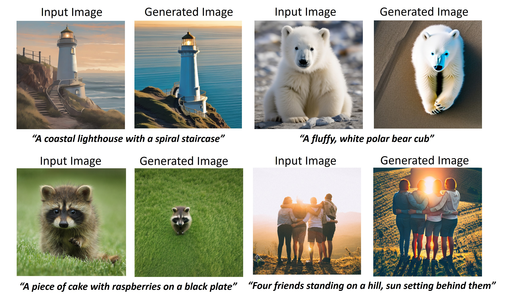
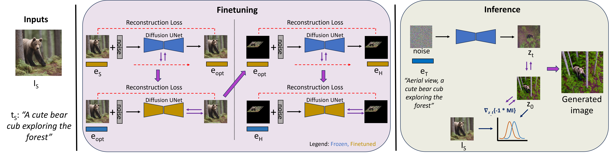

Paper: [**AerialBooth: Mutual Information Guidance for Text Controlled Aerial View Synthesis from a Single Image**]([https://arxiv.org/abs/2303.11444](https://arxiv.org/abs/2311.15478)) (arXiv November 2023)

Please cite our paper if you find it useful. <br>

```
@article{kothandaraman2023aerialbooth,
  title={AerialBooth: Mutual Information Guidance for Text Controlled Aerial View Synthesis from a Single Image},
  author={Kothandaraman, Divya and Zhou, Tianyi and Lin, Ming and Manocha, Dinesh},
  journal={arXiv preprint arXiv:2311.15478},
  year={2023}
}
```

<p align="center">

</p>

### Using the code 

**Datasets**: The datasets, AerialBooth-Real and AerialBooth-Syn datasets can be found in the ./dataset/ folder. <br>
**Models**: The pytorch code for the models are available in the ./models/ folder. <br>
&nbsp;&nbsp;models/aerialbooth - Model definition for AerialBooth <br>
&nbsp;&nbsp;models/aerialbooth_viewarg - Provides support for generating any arbitrary text-controlled view <br>
&nbsp;&nbsp;&nbsp;&nbsp;&nbsp;&nbsp;models/mutual_information - functions for computation of mutual information and earthmovers' distance <br>
&nbsp;&nbsp;models/aerialdiffusion_lora - Model definition for Aerial Diffusion LoRA <br>
&nbsp;&nbsp;models/dreambooth_lora - Model definition for DreamBooth LoRA <br>
&nbsp;&nbsp;models/imagic - Model definition for Imagic LoRA <br>
**Training scripts**: 
&nbsp;&nbsp;Use train_aerialbooth_batch.py to perform optimization and generate the aerial-view image of a given input image. <br>
&nbsp;&nbsp;Use train_aerialbooth_view.py to perform optimization and generate the arbitrary text-controlled views of a given input image. <br>
**Computing the quantitative metrics**: <br>
Use eval_metrics_best_batch to compute the CLIP, SSCD and DINO scores of the generated images.

### Dependencies

torch <br>
cv2 <br>
diffusers <br>
numpy <br>
scipy <br>
accelerate <br>
packaging <br>
transformers <br>

### Method

<p align="center">

</p>

### Acknowledgements

This codebase is heavily borrowed from https://github.com/huggingface/diffusers/blob/main/examples/community/imagic_stable_diffusion.py.
